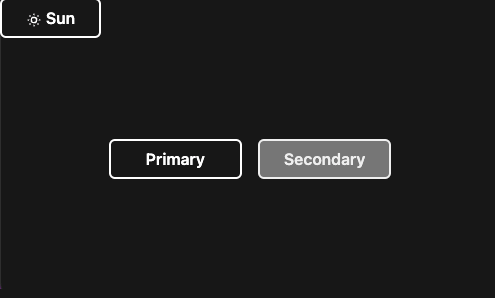

# Figma-tokens : example-tailwindcss-using-css-variables-reference

This repository was created as part of a blogpost on the [Mirahi Digital Garden](https://garden.mirahi.io/).

We will explain how you can transform your tokens stored on [Figma Tokens](https://github.com/six7/figma-tokens) using [token-transformer](https://github.com/six7/figma-tokens/tree/main/token-transformer) and [Style Dictionary](https://github.com/amzn/style-dictionary) to css-variables with references, and use them in your [TailwindCSS](https://github.com/tailwindlabs/tailwindcss) environment with multiple themes.

## Setup

Make sure to install the dependencies:

```bash
# npm
npm install
```

## Build all the styles files (css-variables and tailwind config)

```bash
npm run build-styles
```

## Development Server

Start the development server on http://localhost:3000

```bash
npm run dev
```

Click on the toggle button "dark-light", to switch theme.



## Other examples

You can find [other examples here](https://github.com/six7/figma-tokens-examples) by [Jan Six](https://twitter.com/six7)

## Dependencies

This project uses [style-dictionary](https://github.com/amzn/style-dictionary), [token-transformer](https://github.com/six7/figma-tokens/tree/main/token-transformer), [TailwindCSS](https://github.com/tailwindlabs/tailwindcss), [NuxtJS](https://github.com/nuxt/framework), [@nuxtjs/tailwindcss](https://github.com/nuxt-modules/tailwindcss), [nuxt-icons](https://github.com/nuxt-modules/icon)

## License

[MIT](./LICENSE) License &copy; 2022-PRESENT Mathieu Laurent @ [Mirahi](https://github.com/mirahi-io)

## About

[Mirahi](https://mirahi.io)

We love open source and do our part in sharing our work with the community!
See [our other projects](ttps://github.com/mirahi-io) or [hire our team](https://mirahi.io) to help build your product.
